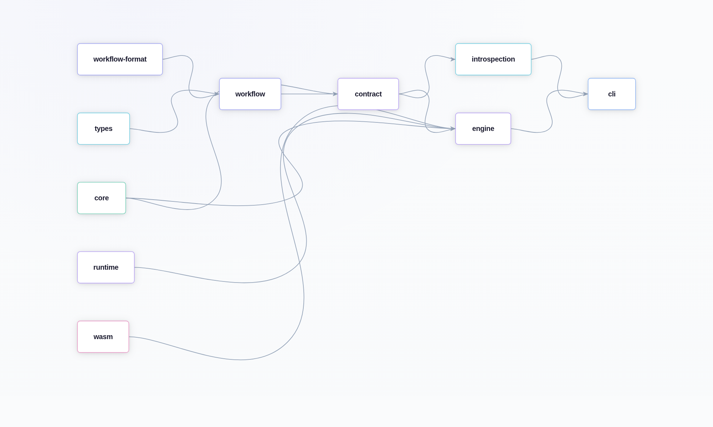

# Package and Contract Boundaries

## Intent

Define crate-level roles and the contract boundaries that keep workflow authoring,
runtime execution, and integration adapters decoupled.

This chapter matters because crate boundaries are not just a packaging detail
here. They are the line between “the thing Pureflow promises” and “the thing a
particular backend happens to use today.”

If the system starts to feel too abstract, this is the chapter to return to. It
shows which parts are foundational, which parts are policy, and which parts are
just adapters.

## Crate Map by Responsibility

The map below is the short version of the crate split.

Think of it as a reading guide for the repository rather than a dependency
chart.

```{=typst}
#table(
  columns: (auto, 1.15fr, 1.2fr),
  inset: (x: 6pt, y: 5pt),
  align: (left, left, left),
  stroke: 0.5pt + luma(220),
  fill: (_, y) => if y == 0 { rgb("#0f172a") } else if calc.rem(y, 2) == 1 { rgb("#f8fafc") } else { rgb("#ffffff") },
  table.header(
    [#text(fill: rgb("#ffffff"))[*Layer*]],
    [#text(fill: rgb("#ffffff"))[*Crates*]],
    [#text(fill: rgb("#ffffff"))[*What it keeps separate*]],
  ),
  [`Definition and validation`], [`conduit-types`, `conduit-workflow-format`, `conduit-workflow`], [`Identifiers, file parsing, and graph shape.`],
  [`Contract and policy`], [`conduit-contract`, `conduit-core`, `conduit-introspection`], [`What a node promises, what it may do, and how we inspect it.`],
  [`Execution and adapter`], [`conduit-engine`, `conduit-runtime`, `conduit-wasm`], [`Orchestration, runtime substrate, and WASM boundaries.`],
  [`Surface and test`], [`conduit-cli`, `conduit-test-kit`], [`User entrypoints and repeatable fixtures.`],
)
```

## Public Contract Surfaces

Core contract surfaces are intentionally narrow and explicit:

```{=typst}
#table(
  columns: (auto, 1fr, 1.1fr),
  inset: (x: 6pt, y: 5pt),
  align: (left, left, left),
  stroke: 0.5pt + luma(220),
  fill: (_, y) => if y == 0 { rgb("#0f172a") } else if calc.rem(y, 2) == 1 { rgb("#f8fafc") } else { rgb("#ffffff") },
  table.header(
    [#text(fill: rgb("#ffffff"))[*Surface*]],
    [#text(fill: rgb("#ffffff"))[*What it describes*]],
    [#text(fill: rgb("#ffffff"))[*Why it stays separate*]],
  ),
  [`Workflow contract`], [`Topology, ports, and edge capacities.`], [`Keeps graph shape independent from node behavior.`],
  [`Node contract`], [`Input/output expectations and execution constraints.`], [`Lets a node change without rewriting the workflow model.`],
  [`Capability surface`], [`What a node may do in a run environment.`], [`Makes policy explicit instead of ad hoc.`],
  [`Runtime trait surface`], [`How executors plug into orchestration.`], [`Keeps the execution seam narrow.`],
  [`Metadata/error surface`], [`Machine-facing events and terminal summaries.`], [`Stabilizes automation and debugging.`],
)
```

The design goal is that each surface can evolve with additive compatibility,
without requiring cross-cutting rewrites in unrelated crates.

That is the real reason for the split. If a new execution backend or adapter
shows up later, the rest of the system should not have to relearn the workflow
format, the contract model, or the metadata schema just because the runtime
changed.

Put differently: each crate answers one question.

- What is the workflow?
- What is allowed?
- How do we execute it?
- How do we observe it?

When those questions stay separate, the code stays easier to read and harder to
break accidentally.

The main architectural benefit of the split is that it keeps the system from
turning every change into a debate about everything else.

## Invariants

The following invariants should hold across releases:

These are the guardrails that keep the split useful.

- Structural graph validity is enforced before execution.
- Contract/capability mismatch blocks execution startup.
- Port schema incompatibility is detected before runtime scheduling.
- Metadata/error record families stay stable for downstream automation.
- Runtime adapters do not redefine core workflow semantics.

Those invariants are what make the architecture feel stable from a human point
of view. A junior engineer should be able to change one layer without
accidentally redesigning three others.

That stability is the reason the table exists at all.

## Compatibility and Versioning Expectations

### Workflow Format Compatibility

```{=typst}
#table(
  columns: (auto, 1fr, 1fr),
  inset: (x: 6pt, y: 5pt),
  align: (left, left, left),
  stroke: 0.5pt + luma(220),
  fill: (_, y) => if y == 0 { rgb("#0f172a") } else if calc.rem(y, 2) == 1 { rgb("#f8fafc") } else { rgb("#ffffff") },
  table.header(
    [#text(fill: rgb("#ffffff"))[*Area*]],
    [#text(fill: rgb("#ffffff"))[*Expectation*]],
    [#text(fill: rgb("#ffffff"))[*Reason*]],
  ),
  [`Workflow format`], [`Additive when possible.`], [`Keeps old documents readable.`],
  [`Contract/capability`], [`Deterministic and auditable semantics.`], [`Preserves trust in the boundary.`],
  [`Metadata`], [`Stable record families and additive fields.`], [`Avoids breaking scripts and dashboards.`],
)
```

### Contract/Capability Compatibility

When you add a feature, the useful question is not only “does this compile?”
It is “which contract surface changed, and who needs to know?”

That is the quickest way to avoid smearing policy across layers.

## Boundary Diagram

{fig-align="center" width="94%"}

## Review Checklist

When adding a feature, confirm:

- the owning crate is clear,
- boundary crossing is explicit (trait/contract/API),
- metadata/error impacts are documented,
- compatibility behavior is tested across old/new fixtures.

If you have to touch multiple crates to make one feature work, that is not
automatically a problem. It just means the feature crosses a boundary that the
guide is trying to keep explicit.

Crossing a boundary is fine. Losing sight of the boundary is what causes the
mess.

## Boundary Takeaways

The crate split is not there to make the tree look tidy. It exists so each
layer can evolve on its own terms while still keeping the architecture
comprehensible.

If a feature forces you to cross multiple crates, that is often a sign that the
feature is real and the boundaries are doing useful work. The point is simply
to cross them consciously.
