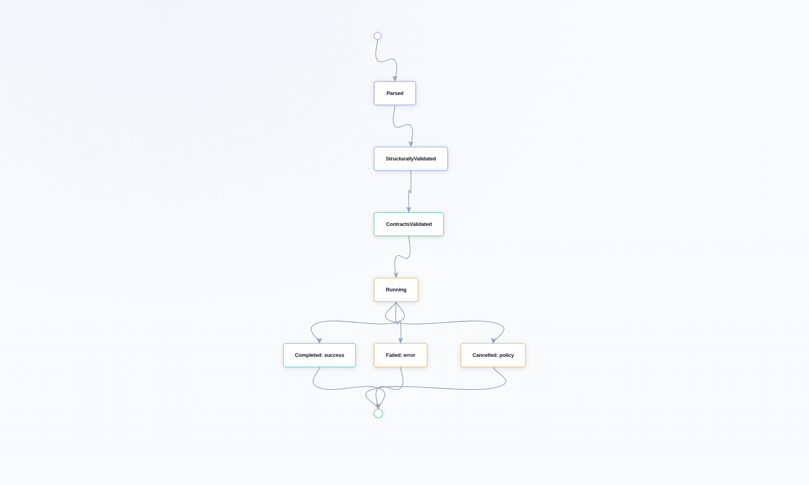
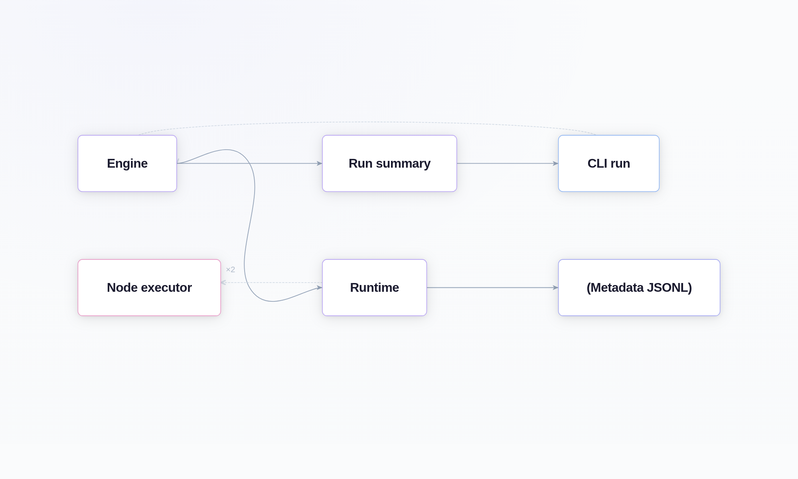

# Runtime Model

## Intent

Explain how execution proceeds from workflow input through node scheduling,
message flow, metadata emission, and terminal summary.

The short version is that Pureflow tries to make execution feel ordinary:
validate first, run second, record what happened as it happens, and stop with a
clear terminal state. That may sound conservative, but it is what keeps the
system understandable when workflows start to get interesting.

The chapter is organized the same way a run happens: first the setup, then the
movement of work, then the point where the run becomes a finished artifact you
can inspect.

## Execution Lifecycle

Pureflow runtime behavior is coordinated by three layers:

- `conduit-cli` handles input/output and user-facing options.
- `conduit-engine` validates execution preconditions, builds run context, and
  orchestrates node execution.
- `conduit-runtime` bridges engine scheduling into the underlying async runtime
  and observer hooks.

That split is not accidental. It keeps the user-facing command path, the policy
layer, and the execution substrate from collapsing into one giant abstraction.

At a high level, execution follows this order:

1. Parse workflow document (`conduit-workflow-format`).
2. Build/validate graph shape (`conduit-workflow`).
3. Validate contracts and capabilities (`conduit-contract` + `conduit-core`).
4. Construct runtime registry for node executors (native and/or WASM).
5. Schedule nodes and move packets over bounded ports.
6. Emit lifecycle/queue/message/error metadata records.
7. Produce terminal `WorkflowRunSummary` for CLI output.

Read that list as a story about the run rather than a checklist. Each step
narrows the question from “is this workflow valid?” to “what happened on this
particular execution?”

{fig-align="center" width="84%"}

### Runtime Layers at a Glance

This table is the simple map of who does what during a run.

```{=typst}
#table(
  columns: (auto, 1fr, 1.2fr),
  inset: (x: 6pt, y: 5pt),
  align: (left, left, left),
  stroke: 0.5pt + luma(220),
  fill: (_, y) => if y == 0 { rgb("#0f172a") } else if calc.rem(y, 2) == 1 { rgb("#f8fafc") } else { rgb("#ffffff") },
  table.header(
    [#text(fill: rgb("#ffffff"))[*Layer*]],
    [#text(fill: rgb("#ffffff"))[*What it does*]],
    [#text(fill: rgb("#ffffff"))[*Reader takeaway*]],
  ),
  [`conduit-cli`], [`Accepts input, prints results, and exposes commands.`], [`This is the human and automation entrypoint.`],
  [`conduit-engine`], [`Validates the run, builds context, and orchestrates execution.`], [`This is where workflow policy turns into scheduling.`],
  [`conduit-runtime`], [`Bridges engine calls into the async substrate and observers.`], [`This is the execution seam, not the public model.`],
)
```

## Runtime Phases and Boundaries

The phases below are the practical way to think about a run from start to
finish.

The phase table below is the fast version. The sections that follow unpack each
step in plain language.

```{=typst}
#table(
  columns: (auto, 1fr, 1.1fr),
  inset: (x: 6pt, y: 5pt),
  align: (left, left, left),
  stroke: 0.5pt + luma(220),
  fill: (_, y) => if y == 0 { rgb("#0f172a") } else if calc.rem(y, 2) == 1 { rgb("#f8fafc") } else { rgb("#ffffff") },
  table.header(
    [#text(fill: rgb("#ffffff"))[*Phase*]],
    [#text(fill: rgb("#ffffff"))[*What happens*]],
    [#text(fill: rgb("#ffffff"))[*What to notice*]],
  ),
  [`Definition and safety checks`], [`Validate identifiers, graph shape, contracts, and schema compatibility.`], [`Failures here are authoring issues, not node bugs.`],
  [`Execution and message transport`], [`Move packets through bounded channels with visible pressure.`], [`Backpressure is part of the design, not a side effect.`],
  [`Terminalization and summary`], [`Emit final records and the terminal run summary.`], [`The stream is for forensics; the summary is for decisions.`],
)
```

### Phase 1: Definition and Safety Checks

Before any node logic runs, Pureflow enforces static safety:

- identifiers and format version are validated,
- graph connectivity and port references are validated,
- contract/capability alignment is checked,
- schema compatibility across connected ports is checked.

This keeps runtime failures focused on execution concerns rather than document
shape mistakes.

It also keeps the guide honest for junior readers: if a workflow fails before
runtime starts, that is usually not a “node problem.” It is a contract,
topology, or capability problem.

That distinction saves time in debugging, because it points attention to the
right layer immediately.

### Phase 2: Execution and Message Transport

During execution, nodes communicate through bounded channels associated with
workflow edges:

- senders reserve queue capacity,
- packets are enqueued/dequeued at typed ports,
- queue pressure is observable via metadata records,
- backpressure is explicit through bounded capacity behavior.

This gives deterministic pressure points for debugging and policy decisions.

It is a small but important detail. Unbounded queues make it too easy to hide a
design problem behind memory growth. Bounded queues force the system to say
“slow down” in a way people can actually observe.

That is why the guide keeps coming back to bounded channels. They are one of
the main reasons the runtime feels legible.

### Phase 3: Terminalization and Summary

When execution reaches a terminal state (`completed`, `failed`, or
`cancelled`), Pureflow emits:

- final metadata records (including terminal lifecycle and error records),
- `WorkflowRunSummary` with status, counts, and metadata path totals.

The summary is the machine-facing endpoint for automation and CI decisions.

That split is deliberate. The metadata stream is for forensics and live
inspection. The summary is for the final answer. Most systems blur those two
ideas together; Pureflow keeps them separate so each one stays simpler.

The result is that automation can stay fast while humans still have enough
history to understand a run afterward.

## Error Handling Model

Pureflow uses stable error taxonomies (`CDT-*`) and structured error payloads so
consumers can branch behavior without string parsing.

The goal is not just nicer errors. The goal is errors that stay meaningful
after the system grows.

Error surfaces are intentionally split:

```{=typst}
#table(
  columns: (auto, 1fr, 1.15fr),
  inset: (x: 6pt, y: 5pt),
  align: (left, left, left),
  stroke: 0.5pt + luma(220),
  fill: (_, y) => if y == 0 { rgb("#0f172a") } else if calc.rem(y, 2) == 1 { rgb("#f8fafc") } else { rgb("#ffffff") },
  table.header(
    [#text(fill: rgb("#ffffff"))[*Surface*]],
    [#text(fill: rgb("#ffffff"))[*When it appears*]],
    [#text(fill: rgb("#ffffff"))[*Why it matters*]],
  ),
  [`Validation errors`], [`Before scheduling starts.`], [`Keeps bad documents out of runtime entirely.`],
  [`Runtime errors`], [`During node execution or transport.`], [`Points at a real execution failure.`],
  [`Terminal summary error`], [`At the end of `run --json`. `], [`Gives automation one canonical decision object.`],
)
```

Retry/recovery policy remains a node/runtime concern and is represented through
contract/core policy types rather than ad hoc CLI-only logic.

That keeps retry behavior where it belongs: with the runtime and the contract,
not buried in a command handler.

## Observability Touchpoints

Observability is first-class in the runtime model and includes:

This part makes runs easier to understand after the fact.

```{=typst}
#table(
  columns: (auto, 1fr, 1.15fr),
  inset: (x: 6pt, y: 5pt),
  align: (left, left, left),
  stroke: 0.5pt + luma(220),
  fill: (_, y) => if y == 0 { rgb("#0f172a") } else if calc.rem(y, 2) == 1 { rgb("#f8fafc") } else { rgb("#ffffff") },
  table.header(
    [#text(fill: rgb("#ffffff"))[*Record family*]],
    [#text(fill: rgb("#ffffff"))[*Tells you*]],
    [#text(fill: rgb("#ffffff"))[*Why it matters*]],
  ),
  [`lifecycle`], [`State transitions across the run.`], [`Shows the lifecycle of the execution itself.`],
  [`message`], [`Where packets moved.`], [`Lets you trace flow without dumping payloads.`],
  [`queue_pressure`], [`Where queues were full or empty.`], [`Makes backpressure visible.`],
  [`error`], [`How a failure was classified.`], [`Supports policy, alerting, and debugging.`],
  [`external_effect`], [`Which side effects were observed.`], [`Makes external behavior explicit and auditable.`],
)
```

That is part of why the runtime model is pleasant to work with. You are not
left inferring state from a pile of ad hoc logs; the engine tells a consistent
story about the run.

That consistency matters more than verbosity.

{fig-align="center" width="86%"}

## Operational Notes

- Queue capacities in workflow edges are part of runtime behavior, not only
  structural metadata.
- Metadata JSONL is designed for tooling and dashboards; it is the canonical
  event stream for run forensics.
- The run summary is intentionally compact and should be preferred for fast
  pass/fail automation.
- Cancellation is represented as a shared Pureflow-owned signal, so a node can
  see the same request that the runtime supervisor sees.
- The runtime wrapper intentionally stays narrow. Most of the interesting
  behavior belongs to Pureflow itself, not to the async substrate.

Those two notes are the practical summary of this chapter.

## Runtime Takeaways

The runtime model is not trying to be clever. It is trying to make the flow of
work, the points of pressure, and the final outcome easy to follow.

That is why the chapter keeps returning to bounded channels, explicit metadata,
and a narrow runtime boundary. If those pieces stay clear, the execution model
stays teachable.
