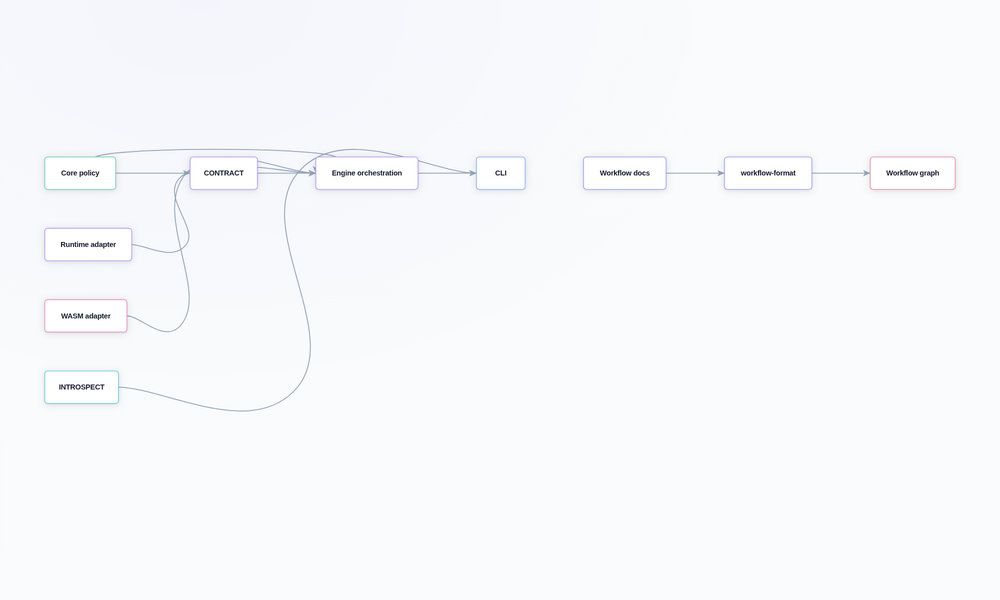
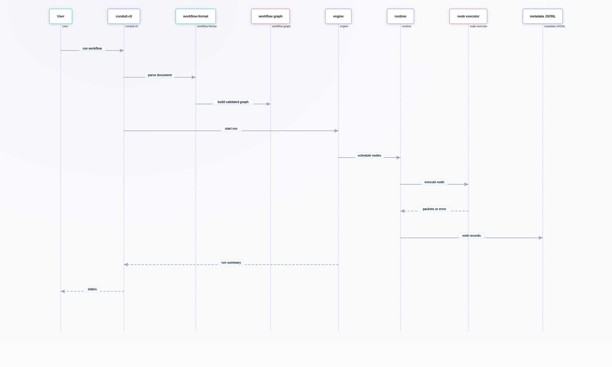

# System Overview

## Pureflow Overview

Pureflow is an experimental Flow-Based Programming engine in Rust. It validates
workflow documents, executes node graphs through bounded channels, and emits
machine-facing metadata and run summaries.

The system is built to keep three things visible at once: what the workflow
looks like, how the run is executing, and where the boundaries of responsibility
actually sit. That is what makes the rest of the guide worth reading slowly.

If you want a mental model, think of Pureflow like a shipping hub:

- the workflow document is the route map,
- nodes are processing stations,
- edges are conveyor belts with finite space,
- metadata is the camera footage and scanner log.

At a high level, Pureflow separates:

- static graph and format validation,
- runtime execution and orchestration,
- contract/capability policy,
- introspection and CLI surfaces.

If you only remember one thing from this chapter, remember that those concerns
are intentionally not mixed together. Most of the design choices in the rest of
the guide are there to protect that separation.

## Original FBP Roots

Pureflow is based on J. Paul Morrison's original Flow-Based Programming model.
That model matters here because it gives the architecture a very practical
shape:

- components behave like long-lived processes instead of one-shot functions,
- data moves over bounded channels instead of through hidden shared state,
- execution is streaming and demand-driven instead of batch-only,
- backpressure becomes visible when downstream work cannot keep up,
- the graph stays loosely coupled because each node only knows its ports.

That fit is deliberate because it keeps the system honest. You can see
where data is waiting, where work is blocked, and where a contract mismatch is
really a wiring problem rather than a mysterious runtime bug.

If you are coming from a more traditional scheduler or queue-heavy design,
this is the part to notice: FBP is not trying to hide the graph. It is trying
to make the graph the thing you reason about.

## Key Terms

The guide uses a few runtime terms in a precise way:

- bounded channels: the edges between nodes have fixed capacity, so sends can
  block or fail instead of growing without limit.
- backpressure: the signal that an upstream node is producing faster than the
  downstream side can consume.
- node: one unit of work in the workflow graph.
- port: a named input or output on a node.
- packet: one item of data moving across a port.
- metadata: machine-readable records that describe what happened during a run.
- capability: a declared permission or restriction on what a node may do.
- contract: the expected shape and behavior of a node at the workflow boundary.

You do not need to memorize the glossary on first read. The point is to keep the
language stable enough that a junior engineer can read one chapter and the next
without translating the vocabulary in their head.

## Why This Architecture Matters

The architecture is built to make the important things visible instead of
leaving them implicit.

- Workflow shape is validated before execution, so a bad document fails early
  and clearly.
- Bounded channels make pressure a first-class event instead of a hidden
  scheduler accident.
- Runtime metadata records what happened while the run is still live, which
  makes debugging and replay easier than reconstructing a story from logs after
  the fact.
- Capability and contract checks keep the node boundary honest, which matters
  more as execution modes get more diverse.
- The same design gives Pureflow room to run native nodes, WASM nodes, and
  future adapters without rewriting the whole graph model.

That combination is what makes the system interesting: it behaves like a
serious execution engine, but it still tries to keep the logic comprehensible
to a person reading the code for the first time.

Pureflow is trying to be the kind of system you can
debug by reading from top to bottom, not the kind you need to reverse-engineer
from a pile of moving parts.

## Layered Architecture

The figure below shows the major crates and handoffs.

{fig-align="center" width="92%"}

## Crate Responsibilities

```{=typst}
#table(
  columns: (auto, 1fr, 1fr),
  inset: (x: 6pt, y: 5pt),
  align: (left, left, left),
  stroke: 0.5pt + luma(220),
  fill: (_, y) => if y == 0 { rgb("#0f172a") } else if calc.rem(y, 2) == 1 { rgb("#f8fafc") } else { rgb("#ffffff") },
  table.header(
    [#text(fill: rgb("#ffffff"))[*Crate*]],
    [#text(fill: rgb("#ffffff"))[*Primary responsibility*]],
    [#text(fill: rgb("#ffffff"))[*Used by*]],
  ),
  [`conduit-types`], [`Validated identifier primitives (WorkflowId, NodeId, PortId)`], [`all crates`],
  [`conduit-workflow-format`], [`External format decode + versioning (conduit_version)`], [`CLI + loaders`],
  [`conduit-workflow`], [`Static topology model + structural validation`], [`contract/introspection/engine`],
  [`conduit-core`], [`Runtime-facing traits, ports, metadata, errors, capabilities`], [`runtime/engine/cli/wasm`],
  [`conduit-contract`], [`Node contract model + validation against workflow/capabilities`], [`engine/introspection/cli`],
  [`conduit-introspection`], [`Read-only workflow+contract+capability projections`], [`CLI inspect/explain`],
  [`conduit-runtime`], [`asupersync runtime wrapper + node observer boundary`], [`engine`],
  [`conduit-engine`], [`Workflow orchestration, registry scheduling, summary/policy`], [`CLI`],
  [`conduit-wasm`], [`Wasmtime Component Model batch execution adapter`], [`engine/CLI`],
  [`conduit-cli`], [`User and automation entrypoint`], [`humans/CI`],
  [`conduit-test-kit`], [`Builders and helpers for tests/examples`], [`tests/docs`],
)
```

## Runtime Data Flow

Another way to read this: CLI is the dispatcher, engine is the floor manager,
runtime is the shift supervisor, and each node is a station doing one job.

This picture matters because it matches how the code is split. The CLI handles
entry and exit, the engine decides what should happen, the runtime makes the
work actually run, and the nodes stay focused on their own logic.

{fig-align="center" width="90%"}

## Why WASM Helps Here

WASM is useful in Pureflow because it gives you a narrow, portable execution
boundary without asking the rest of the system to trust a whole host runtime.

The value here is not just “WASM is safer.” It is that WASM gives Pureflow a
second implementation path without letting that path leak into the core model.

- A WASM node is easier to ship and inspect than a native plugin with deep host
  reach.
- The host owns the channels, so the graph still looks like Pureflow even when a
  node is compiled to a different execution target.
- The capability boundary stays explicit. If a guest cannot reach the network
  or filesystem, that limitation is visible in the adapter instead of hidden in
  the node implementation.
- The batch-style component model keeps the WASM story focused on data in, data
  out, which is a good fit for flow graphs.

This means WASM is not just a deployment trick. It is a way to
make extension safer, more portable, and easier to reason about when the engine
starts to grow.

That makes it a good fit for a system that wants strong boundaries and a clear
story for how untrusted or semi-trusted code fits into the graph.

## Why `asupersync` Instead of Tokio

Tokio is a strong general-purpose async ecosystem, but Pureflow does not need a
general-purpose app runtime to explain its own model. It needs a substrate that
stays out of the way while still giving the engine task-tree execution,
cancellation, and bounded channel behavior.

The goal is to keep the runtime layer boring in the right way: it
should execute Pureflow's model, not define a second one.

That is why `asupersync` sits underneath `conduit-runtime` rather than being
the public model itself.

- Pureflow owns the graph, ports, contracts, metadata, and capability story.
- `asupersync` provides the execution machinery that makes those ideas run.
- The boundary stays narrow, which makes it easier to test and easier to
  replace later if the project ever needs to.
- The public API does not inherit Tokio’s larger vocabulary when Pureflow only
  needs a smaller one for workflow execution.

There is nothing wrong with Tokio in general. The point is simply that Pureflow
is trying to teach and preserve its own runtime story, not inherit a broader
framework story it does not need.

That makes the boundary easier to test, easier to describe, and easier to swap
later if the project ever needs to.

## Metadata Surfaces and Usage

Pureflow emits two machine-facing outputs:

- metadata JSONL stream (event records),
- `conduit run --json` terminal summary.

The short version: JSONL is the play-by-play, while the summary JSON is the
box score at the end of the game.

The two outputs serve different readers. One is for tracing the run while it is
happening. The other is for the final yes/no decision when the run is over.

### Metadata JSONL record families

Use the first table when you are following the shape of a normal run. It is the
timeline view.

```{=typst}
#table(
  columns: (auto, 1fr, 1fr),
  inset: (x: 6pt, y: 5pt),
  align: (left, left, left),
  stroke: 0.5pt + luma(220),
  fill: (_, y) => if y == 0 { rgb("#0f172a") } else if calc.rem(y, 2) == 1 { rgb("#f8fafc") } else { rgb("#ffffff") },
  table.header(
    [#text(fill: rgb("#ffffff"))[*record_type*]],
    [#text(fill: rgb("#ffffff"))[*Produced by*]],
    [#text(fill: rgb("#ffffff"))[*Why it matters*]],
  ),
  [`execution_context`], [`runtime observer boundary`], [`Ties records to workflow, node, attempt, and cancellation state.`],
  [`lifecycle`], [`runtime + engine`], [`Shows node start, completion, failure, and cancellation transitions.`],
  [`message`], [`port boundary instrumentation`], [`Shows packet movement without exposing payload bytes.`],
  [`queue_pressure`], [`port reserve/recv boundaries`], [`Shows capacity and queue state when backpressure matters.`],
)
```

Use the second table when you are looking for what went wrong, or what side
effects were intentionally observed.

```{=typst}
#table(
  columns: (auto, 1fr, 1fr),
  inset: (x: 6pt, y: 5pt),
  align: (left, left, left),
  stroke: 0.5pt + luma(220),
  fill: (_, y) => if y == 0 { rgb("#0f172a") } else if calc.rem(y, 2) == 1 { rgb("#f8fafc") } else { rgb("#ffffff") },
  table.header(
    [#text(fill: rgb("#ffffff"))[*record_type*]],
    [#text(fill: rgb("#ffffff"))[*Produced by*]],
    [#text(fill: rgb("#ffffff"))[*Why it matters*]],
  ),
  [`error`], [`node/workflow failure paths`], [`Gives a stable error taxonomy for branching, retry policy, and diagnostics.`],
  [`external_effect`], [`node integration code`], [`Makes tool, service, database, and API side effects explicit.`],
)
```

### Run summary JSON fields

```{=typst}
#table(
  columns: (auto, 1fr, 1fr),
  inset: (x: 6pt, y: 5pt),
  align: (left, left, left),
  stroke: 0.5pt + luma(220),
  fill: (_, y) => if y == 0 { rgb("#0f172a") } else if calc.rem(y, 2) == 1 { rgb("#f8fafc") } else { rgb("#ffffff") },
  table.header(
    [#text(fill: rgb("#ffffff"))[*Field*]],
    [#text(fill: rgb("#ffffff"))[*Meaning*]],
    [#text(fill: rgb("#ffffff"))[*Notes*]],
  ),
  [`status`], [`terminal state (completed, failed, cancelled)`], [`primary machine decision field`],
  [`error`], [`terminal error object or null`], [`mirrors stable Pureflow error shape`],
  [`workflow`], [`workflow identity and shape counts`], [`quick context for automation`],
  [`metadata`], [`output metadata path and record totals`], [`ties summary to JSONL artifact`],
  [`summary`], [`node scheduling/completion/failure counts`], [`execution outcome snapshot`],
)
```

## Important Examples

### CLI usage

```bash
# Validate workflow structure and format
cargo run -p conduit-cli -- validate examples/native-linear-etl.workflow.json

# Inspect topology/contracts/capabilities
cargo run -p conduit-cli -- inspect examples/native-linear-etl.workflow.json

# Run and emit machine-facing summary
cargo run -p conduit-cli -- run --json \
  examples/native-linear-etl.workflow.json \
  /tmp/conduit-native-linear.metadata.jsonl
```

### Workflow document shape

```json
{
  "conduit_version": "1",
  "id": "native-linear-etl",
  "nodes": [
    { "id": "source", "inputs": [], "outputs": ["rows"] },
    { "id": "transform", "inputs": ["rows"], "outputs": ["cleaned"] },
    { "id": "sink", "inputs": ["cleaned"], "outputs": [] }
  ],
  "edges": [
    {
      "source": { "node": "source", "port": "rows" },
      "target": { "node": "transform", "port": "rows" },
      "capacity": 2
    }
  ]
}
```

### Contract/capability alignment example (Rust)

```rust
use conduit_contract::{
    Determinism, ExecutionMode, NodeContract, PortContract, SchemaRef,
    validate_workflow_contracts,
};
use conduit_core::{
    RetryDisposition,
    capability::{NodeCapabilities, PortCapability, PortCapabilityDirection},
};

// Build contracts and capabilities for each workflow node, then validate:
validate_workflow_contracts(&workflow, &contracts, &capabilities)?;
```

This is a key authoring boundary for both humans and future LLM assistants:
workflow topology, contracts, and capabilities must match before execution.
If those three disagree, Pureflow treats it like a wiring mismatch and stops
before runtime surprises can happen.

That rule is part of the architecture's value. It catches structural mistakes
before they turn into runtime folklore.

## Boundary Decisions

These are the boundaries worth remembering while reading the code:

```{=typst}
#table(
  columns: (auto, 1.15fr, 1.35fr),
  inset: (x: 6pt, y: 5pt),
  align: (left, left, left),
  stroke: 0.5pt + luma(220),
  fill: (_, y) => if y == 0 { rgb("#0f172a") } else if calc.rem(y, 2) == 1 { rgb("#f8fafc") } else { rgb("#ffffff") },
  table.header(
    [#text(fill: rgb("#ffffff"))[*Crate*]],
    [#text(fill: rgb("#ffffff"))[*Owns*]],
    [#text(fill: rgb("#ffffff"))[*Why it matters*]],
  ),
  [`conduit-workflow`], [`Structural graph honesty only.`], [`Keeps shape validation separate from policy.`],
  [`conduit-contract`], [`Contract/capability alignment and schema compatibility.`], [`Catches wiring mismatches before runtime.`],
  [`conduit-core`], [`Runtime interfaces and metadata shape.`], [`Defines the Pureflow-owned runtime vocabulary.`],
  [`conduit-runtime`], [`The `asupersync` adapter boundary.`], [`Hides substrate details behind Pureflow types.`],
  [`conduit-wasm`], [`Wasmtime and WIT/component ABI details.`], [`Keeps WASM specifics out of core.`],
)
```

If you are skimming the code, this table is the chapter's spine. Anything that
crosses one of these lines should be obvious in the types or the module name.

## Open Questions

These are the points where code and docs suggest open questions or evolving
policy. I recommend focused follow-up review on each.

They are not red flags so much as reminders that the design is still learning
where its hard edges need to be.

```{=typst}
#table(
  columns: (auto, 1fr, 1.25fr),
  inset: (x: 6pt, y: 5pt),
  align: (left, left, left),
  stroke: 0.5pt + luma(220),
  fill: (_, y) => if y == 0 { rgb("#0f172a") } else if calc.rem(y, 2) == 1 { rgb("#f8fafc") } else { rgb("#ffffff") },
  table.header(
    [#text(fill: rgb("#ffffff"))[*Open area*]],
    [#text(fill: rgb("#ffffff"))[*Current state*]],
    [#text(fill: rgb("#ffffff"))[*Why follow-up matters*]],
  ),
  [`Feedback loops`], [`Cycle support exists, but production semantics are not fully documented.`], [`Cycles change startup, deadlock, and cancellation behavior.`],
  [`Process execution mode`], [`ExecutionMode::Process exists, but the adapter contract is future-facing.`], [`This could become a real enforcement boundary later.`],
  [`External effects`], [`external_effect records exist, but naming guidance is loose.`], [`Audit trails need stable vocabulary.`],
  [`Queue pressure`], [`Kinds are defined, but thresholds and interpretation rules are not.`], [`People need guidance, not just record names.`],
  [`WASM capability evolution`], [`Import-free mode rejects declared effects today.`], [`Host imports will need clear migration rules.`],
)
```

Think of this as a short list of design work, not a list of defects.

## Chapter Takeaways

Pureflow works best when the workflow document, runtime behavior, and capability
policy remain separate things that meet at the boundary instead of collapsing
into one blurry execution blob.

That is the recurring theme in this chapter. Bounded channels, explicit
contracts, and narrow adapters all serve the same goal: keep the graph legible
enough that a human can reason about it without carrying the whole system in
their head at once.

If the architecture continues to feel coherent as the code grows, it is because
those boundaries are still doing their job.
